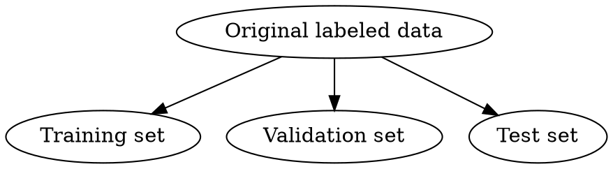

# **Preclass Session 1: Representation**

## **Coordinates**
- See the simulation of [Cartesian Coordinate System](https://www.geogebra.org/m/Dyf6yMWt)
—(-0.7)—(-0.5)——0——z———0.9—> $\phi$: "cat cry"
- The **z-coordinates** indicate the presence/occurrence of the $phi$ characteristic in the object we are observing. For example, if another cat has $z'=0.95$, we can guess that this cat has a very loud cry throughout the neighborhood. A practical example $\phi$ = "edge detector" featured in Wiesel & Hubel's vision experiment (watch [experiment](https://www.youtube.com/watch?v=Cw5PKV9Rj3o) in 1959, winning 1981 Nobel Prize "for their discoveries concerning the visual system.") 

<center></center>

## **Principal Component Analysis**
1. Given a dataset $D=\{{\bf x}^1,\dots,{\bf x}^t,\dots,{\bf x}^N\} = \{{\bf x}^t\}_{t=1}^N$ where ${\bf x}^t$ is a gray-scale image with ${\bf x}^t \in \mathbb{R}^{m \space {\bf x} \space n}$

2. Principal Component Analysis allow us to extract $n < N$ features $(u_1, \dots, u_n)$  to represent each ${\bf x}^t$. As follows:

$${\bf x}^t = \bar{\bf x} + z_1^t u_1 + \dots + z_n^t u_n$$ 

3. We have: $\bar{\bf x} = \frac{{\bf x}^1 + \dots +{\bf x}^t + \dots + {\bf x}^N}{N}$ is the mean value of the $D$ and $u_i$ features are:
    - [Orthonormality](https://en.wikipedia.org/wiki/Orthonormality)
    - Same shape with input ${\bf x}$
    - Arranged in order of importance from 1 to n so that the mean squared error is always the samllest when using $1 \leq k < n$ first initial features $(u_1, \dots, u_k)$ to represent approximately the dataset 
    - Specifically when approximately equal to k main components ${\bf x}^t \approx \tilde{\bf x}^t_k = \bar{x} + z_1^t + \dots + z^t_k u_k \rightarrow$ square error at one sample is $e^t_k = \|{\bf x}^t - \tilde{\bf x}^t_k\|$
    
4. PCA help to find $(u_1, \dots, u_n)$ with the smallest sum error $\frac{1}{N} \sum_{t=1}^N e^t_k$ on the dataset $D$ for all approximate $1  \leq k < n$
5. For example for 1 dataset of faces, features are the main components and the average image calculated by PCA as shown below:

<center></center>


## **Sparse Coding**
1. Sparse Coding is method to extract features of a dataset $D = \{\bf x^t\}_{t=1}^N$:

    - some $n < N$ features $(c_1, \dots, c_n)$ are often selected from some inputs to make `codewords` to make a (dictionary, codebook)
    - All input ${\bf x}^t$ can be best approximately represented (MSE on dataset $D$) with no more $k\ll n$ codewords: ${\bf x}^t \approx z_1^t{\bf c}_1 +\dots+ z_n^t{\bf c}_n$ with most $z_i^t=0$ and a very small number $k$ coefficient $z_j^t\neq 0$. 

2. For example, from natural photos, we take out small patches, then use the Sparse Coding method to select a dictionary with 64 features of edges as shown below. Each image will then be encoded with no more than 3 codewords.
<br>
<center></center>

## **Similarity**

1. For AI to be able to identify, classify, and predict from input ${\bf x}$ effectively, We can perform similarity measurements, also known as matching, on embedded coordinate vectors ${\bf z}=(z_1,\dots,z_n)$ right in the semantic space of the extracted features $\phi_1,\dots,\phi_n$.

2. Some of the most popular similarity measurements (matching):
    1. Dot product (scalar product) ${\bf z}\cdot{\bf z}' = {\bf z}'\cdot{\bf z}=z_1z_1'+\dots+z_nz_n'=\sum_{i=1}^nz_iz_i'$ 
    
        - The more positive we conclude ${\bf z}, {\bf z}'$, the more similar ${\bf x}, {\bf x}'$ are in terms of the feature extrators $\phi_1,\dots,\phi_n$ considererd.
        - Conversely, the more negative the dot product, the more different and more contradictory they are.
        - When very small dots near zero, they are almost unrelated (orthogonal, uncorrelated).
        
    2. We can standardize the dot product to bring the similarity score to the range $[-1,1]$ for easy calculation and comparison, in 2 ways:
        - [Correlation coefficient](https://en.wikipedia.org/wiki/Pearson_correlation_coefficient) = centered dot product ${\dot {\bf z}}\cdot{\dot {\bf z}}'$ with ${\dot {\bf z}} = (z_1-\bar{z},\dots,z_n-\bar{z})$ and ${\bar z}=\frac{z_1+\dots+z_n}n$.
        - [Cosine similarity](https://en.wikipedia.org/wiki/Cosine_similarity) = normalized dot product ${\bar {\bf z}}\cdot{\bar {\bf z}}'$ with ${\bar {\bf z}} = \frac{{\bf z}}{\|{\bf z}\|}$ and $\|{\bf z}\| = \sqrt{{\bf z}\cdot{\bf z}}$

    3. We can extend the dot product to 2 arrays (tensor, e.g. 2 color images) of the same size (shape): $A\cdot B = \sum_{ijjk}a_{ijk}b_{ijk}$
    
    4. When 2 arrays are not the same shape, for example $A$ is a large color image, $\kappa$ is a small color image of $3\times 3$ pixels (called kernel, template or filter)
        - We can slid the core $\kappa$ on $A$ and match it with dot product at each position, creating an image called a feature map.
        - This method of calculation is called `convolution`, very important in AI.
        
    5. All 4 methods above are sensitive to the original point selection (zero point, centering) of embedded coordinates $z_i$ because it involves the semantics of the extracted and used features. Distance measures can overcome this weakness. For example Euclidean distance: $d =\sqrt{\|{\bf z} - {\bf z}’\|}$. This method is applied in [K-means clustering](https://en.wikipedia.org/wiki/K-means_clustering) and [KNN](https://en.wikipedia.org/wiki/K-nearest_neighbors_algorithm)
    
    
## **Sklearn library**
1. Most of the modules in sklearn library are often used as follows:
```python
# Initialize and fit
my_algo = AlgorithmName(parameters)
my_algo.fit(train_set)


# Transformation
my_ago.transform(train_set)
my_ago.transform(val_set)
my_ago.transform(test_set)

# Predict
my_ago.predict(train_set)
my_ago.predict(val_set)
my_ago.predict(test_set)
```

## **Splitting dataset**
### Train test split


`train_test_split` in `sklearn`
```python
from sklearn.model_selection import train_test_split
x_train, x_test, y_train, y_test = tran_test_split(x, y,
                                                   test_size=0.4,
                                                   shuffle=True,
                                                   random_state=42)
```

Split the test set into validation set and test set
```python
x_val, x_test, y_val, y_test = train_test_split(x_test, y_test, 
                                                test_size=0.5, 
                                                shuffle=True, 
                                                random_state=42)
```
So the ratio of `training set` : `test set` : `val set` is: `60 : 20 : 20`

### **Stratified Split (only for Classification problems)**
We have to add the parameter `stratify=y` into the function `train_test_split`. The ratio of classes (the distribution) in training, test, and val set is the same

```python
from sklearn.model_selection import train_test_split
x_train, x_test, y_train, y_test = train_test_split(x,y, 
                                                    stratify=y, 
                                                    test_size=0.5, 
                                                    shuffle=True, 
                                                    random_state=42)
```