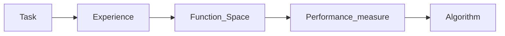

# **Preclass Session 2: Linear Model**

## **Prediction Types**
1. Four statistical data types
<center></center>

2. Two prediction types
<center></center> <br>

- Predict a continuous value: [regression](https://en.wikipedia.org/wiki/Regression_analysis). For each input ${\bf x}^t$ the model (i.e., our `“fantastic function”`) predicts a real value ${\hat y}^t\in\mathbb{R}$. Optional reading: [Why the name regression?](https://blog.minitab.com/en/statistics-and-quality-data-analysis/so-why-is-it-called-regression-anyway)

- Predict a discrete `class/type`: [classification](https://en.wikipedia.org/wiki/Statistical_classification) & [clustering](https://en.wikipedia.org/wiki/Statistical_classification). For each input ${\bf x}^t$ the model predicts a class label ${\hat y}^t$ from a set $\bf Y \ni {\hat y}^t$. For example, binary classification has $\bf Y=\{0,1\}$ or $\bf Y=\{-1,1\}$, and, for convenience, multiclass case has $\bf Y=\{1,\dots,K\}$.

## **Function & TEFPA**
1. Modeling `“fantastic functions”`: input ${\bf x}\overset{f_\theta}{\to} predictions {\bf {\hat y}}$

$$input {\bf x} \xrightarrow[(\phi_1\dots\phi_n)]{\text{features}} embedding coordinates {\bf z} =(z_1, \dots, z_n) \xrightarrow[\text{generators}]{\text{predictors}} output {\bf \hat{y}}$$


- The input/output pair $({\bf x},y)$ defines the specific task $\mathcal{T}$ of this `“fantastic”` function (in ML we call it a **model**). 
- A function can be parametrized using parameters ${\boldsymbol \theta}$ (called a parametric function).
    - Its chosen `structure/type` induces a function space $\mathcal{F}$ for these parametric functions to live in. 
    - The type/structure is called `model class`.

2. Analogy: think of function as a machine. 

- Its parameters are just like knobs, switches and sliders adjusting the machine. 
- All possible configurations/settings of the knobs/parameters constitute a space of machines/functions of this particular type. 
- The model classes are like diamond-shaped, box-shaped, or pipeline-shaped machine types.

<center></center> <br>

-  Example: 
    - Linear function $y=ax+b$ with input $\bf x$, output $\bf y$, params (knobs) ${\boldsymbol \theta} = (a,b)$. 
    - Quadratic function $y=ax^2+b$ also has 2 parameters but with different type/structure.
    - Notation: $y=f_\theta(x) = f(x;\theta)$.
    - Coefficient a acts as a knob [rotating/reflecting](https://www.geogebra.org/m/hqPTmW83) the graph of $y$ about the origin 0 for linear case, and [curving/bending](https://www.geogebra.org/m/uXz7MEhY) the graph of y for quadratic case.
    - [Intercept $b$](https://en.wikipedia.org/wiki/Y-intercept) acts as a slider [translating](https://en.wikipedia.org/wiki/Translation_(geometry)) the graph of y, hence also known as `bias/offset` term.


3.Learning (or training; more details in coming lectures) is giving computer a sample dataset D for it to find (near)optimal parameters ${\boldsymbol {\hat \theta}}$.

- Learning/training then means getting ${\boldsymbol {\hat \theta}} \xleftarrow[\text{optimize}]{\text{search}} (f_\theta,D)$ by `“fitting”` $f_\theta$ into dataset $D$. 
- The training dataset $D$ is thus a form of experience ${\mathcal E}$ for the computer to `“learn”`.
- For **classification** and **regression**, we need to **annotate** or **label** the dataset, i.e., assigning output $y^t$ for each input ${\bf x}^t:  D=\{({\bf x}^t,y^t)\}_{t=1}^N$, hence the name `supervised learning`.
- We need a **performance measure** $\mathcal{P}$ (in ML we have metrics & losses; more in coming classes) to say how well a specific model $f_{\theta^k}$ performs on the given dataset $D$ using a specific set of parameters ${\boldsymbol \theta}^k$.  
    - Usually it is a scalar number, i.e., ${\mathcal P}: {\boldsymbol \theta}^k \xrightarrow{(f_\theta,D)} \text{a score}\in\mathbb{R}$. 
    - Essentially, performance measure $\mathcal{P}$ is a regression function with parameters ${\boldsymbol \theta}$ as its input.

- To find a (near)optimal set of parameters ${\boldsymbol {\hat \theta}}$ we need to give computer a search, optimize (learn, train) algorithm ${\mathcal A}$ to move in the function space, i.e., changing from ${\boldsymbol \theta}^k$ to ${\boldsymbol \theta}^{k+1}$ for better performance.


4.The unified Machine Learning framework `TEFPA` 



5.Our fantastic functions can be parametrized as $f_\theta = ({\boldsymbol \phi}_\alpha, p_w)$ for predictions and $f_\theta = ({\boldsymbol \phi}_\alpha, g_\beta)$ for generation. 

When we learn/train both the features/encoder ${\boldsymbol \phi}_\alpha$ and predictor $p_w$ (or generator/decoder $g_\beta$) simultaneously it’s called `end-to-end` learning/training. 

In this Session 2 we only consider training the predictor $p_w$ assuming the embeddings ${\bf z}$ are given by a pre-trained model ${\boldsymbol \phi}_\alpha$ for feature extraction. 
## **Classifiers**

<center></center><br>

Note: The above graphic uses notations different from below explanations:
- Prediction score ${\hat z}_i\in\mathbb{R}$ $\rightarrow$ ${\hat y}_i\in\mathbb{R}$ 
- ${\bf {\hat z}} = ({\hat z}_1,\dots,{\hat z}_i,\dots,{\hat z}_C)$ $\rightarrow$  ${\bf {\hat y}} = ({\hat y}_1,\dots,{\hat y}_i,\dots,{\hat y}_K)$  
- $C$ classes $\rightarrow$  $K$ classes

**1. Multiclass Classfication**
- We need to give a prediction score ${\hat y}_i\in\mathbb{R}$ for each class ID $i$. Thus, for the case of K classes, the prediction score is a vector ${\bf {\hat y}} = ({\hat y}_1,\dots,{\hat y}_i,\dots,{\hat y}_K)^\top\in\mathbb{R}^K$.
- Now the output predicted label of $f_\theta$ is simply $\arg\max_k {\bf {\hat y}}$ (or the top-k scores if we want to predict several k classes with highest scores.)

**2. Binary Classfication**
- For the case of binary label $y\in\{0,1\}$ or `True/False`, or  $y\in\{-1,1\}$, we can use a single score value ${\hat y}\in \mathbb{R}$ then compare it with a threshold $\delta$ to give predicted label, e.g., usually $\delta = 0.5$ for the case  $y\in\{0,1\}$

    - If ${\hat y}\geq\delta$ then output a predicted label of `1/True`; otherwise output a predicted label of `0/False` or `-1`. We can write compactly using indicator function: **predicted label** $=\mathbf{1}_{[\hat{y}\geq\delta]}$
    - If $\delta$ = 0 and $y\in\{-1,1\}$, we can use $\text{sign}({\hat y})$ to output the predicted label.
    
**3. Activation Functions**
- We can convert the prediction scores ${\hat y}_i\in\mathbb{R}$ into a desired range using a **transfer** $s(~)$ also called [activation function](https://en.wikipedia.org/wiki/Activation_function) in ML. For example: 

    - [Logistic sigmoid function](https://en.wikipedia.org/wiki/Logistic_function) $\sigma({\hat y})\in [0,1]$ for probability of True class. [Geogebra viz](https://www.geogebra.org/m/vegkdavv).
    - [Tanh function](https://paperswithcode.com/method/tanh-activation) $\tanh({\hat y}) \in [-1,1]$ can be converted into probability of True class as $\frac{1+\tanh({\hat y})}2$. Geogebra viz.
    - [Softmax function](https://en.wikipedia.org/wiki/Softmax_function) acts on each component ${\hat y}_k$ (element-wise) to convert prediction score vector ${\bf y}$ into a probability vector $\text{softmax}({\bf y})$

<center></center>

## **Tensorflow library**
1. Declare the type of model
```python
from tensorflow.keras.models import Sequential
model = Sequential()
```

2. Declare layers
```python
from tensorflow.keras.layers import Input, Dense

# Layer parameters
n_features = (784)
n_outputs = 10
output_function = "softmax"

# Initialize layers
input = Input(shape=n_features)
dense = Dense(n_outputs, activation=output_function)

# Add layers into model
model.add(input)
model.add(dense)
```

3. Compile
```python
# Define loss, metrics and optimizer
loss = "categorical_crossentropy"
metrics = ["accuracy"]
optimizer = "adam"

model.compile(loss=loss, metrics=metrics, optimizer=optimizer)

# Display the architecture of model
model.summary()
```

4. Fit (or train)
```python
history = model.fit(x_train, y_train, validation_data=(x_val, y_val), epochs=20)
```

5. Predict
```python
model.predict(x_test)
# Sigmoid Regression: apply the thresholding to determine the label.
# Softmax Regression: apply the argmax to determine the label.
```