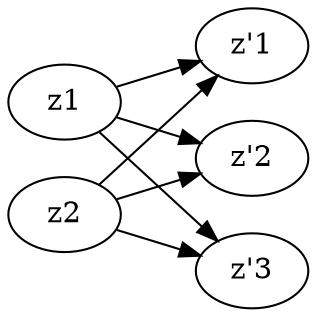

# Session 4: Revision

## **Theory**
### **Question 1**
Giải thích vì sao phép biến đổi phi tuyens tính $\bf z'=\phi{z} = \gamma(Wz + b)$ bởi 1 lớp neuron, perceptron lại có tác dụng "xoay-co/giãn-xoay" rồi xê dịch và cuối cùng là bóp/nắn/cắt trong không gian tọa độ $\bf z$ để cho ra không gian tọa độ $\bf z'$ giúp cho linear predictors hiệu quả hơn.

### **Answer**
Ta có **Linear Transformation**: $\bf z \rightarrow z'$ 
- $\bf Wz$: tọa độ $z$ sẽ bị biến đổi bởi ma trận $\bf W$ theo các cách sau:
    - $\bf W$ là ma trận trục chuẩn $\rightarrow$ phép xoay $\bf z$ quanh các trục $\phi$ của $\bf z$ thành $\phi'$ quanh trục $O$ $\rightarrow$ $\bf z'$
    - $\bf W$ là ma trận đường chéo $\rightarrow$ phép co giãn trục tọa độ $\phi$ vơi tỉ lệ nghịch đảo $\frac{1}{\lambda}$ của $\bf z$ thành $\phi'$ $\rightarrow$ $\bf z'$
    - $\bf W = USV^\top$ là ma trận bất kỳ $\rightarrow$ xoay ($\bf V^\top$) + co giãn ($\bf S$) + xoay ($\bf U$) $\rightarrow \bf z'$  
- $\bf Wz + b$: dời đi một đoạn $b$
- $\gamma(\bf Wz + b)$: sau đó bị bóp/nắn/cắt bởi activation $\gamma$ cho ra $\bf z'$ có giá trị trong khoảng mong muốn.

### **Question 2**
Chứng minh hoặc giải thích vì sao 1 lớp neuron/perceptron $\bf z'= \phi(z) = \gamma(Wz + b)$ còn có tác dụng trích xuất các đặc trưng bậc cao từ những dặc trưng bậc thấp. Cụ thể nhưng đặc trưng ở đây là gì?
### **Answer**
Ví dụ $\bf z$ có hai chiều (features) $\bf z = (z1,z1)$ hay là lớp layer input có 2 units sau đó lớp layer thứ 2 (hidden layer) có 3 units (3 chiều - higher-dimension) $\rightarrow$ ma trận $\bf W$ có tổng số parameters $2 \times 3 = 6$ và 3 bias hay $\bf b \in \mathbb{R}^3$ và $\bf W \in \mathbb{R}^{3 \times 2}$ $\rightarrow$ $\bf z' = W^\top z + b \in \mathbb{R}^3$. 

$$
\left[ \begin{matrix}
\mathbf{z}_1 \newline
\mathbf{z}_2 \newline
\end{matrix} \right]
\left[ \begin{matrix}
\mathbf{w}_{11} & \mathbf{w}_{12} \newline
\mathbf{w}_{21} & \mathbf{w}_{22} \newline
\mathbf{w}_{31} & \mathbf{w}_{32} \newline
\end{matrix} \right]^\top \text{+}
\left[ \begin{matrix}
\mathbf{b}_1 \newline
\mathbf{b}_2 \newline
\mathbf{b}_3 \newline
\end{matrix} \right]
= \left[ \begin{matrix}
\mathbf{z'}_1 \newline
\mathbf{z'}_2 \newline
\mathbf{z'}_3 \newline
\end{matrix} \right]
$$

## **Summary - Nonlinear Predictors**
### **Regression**
1. Regression curve: $y = c(x)$
2. Regression surface: $y = g(x,y)$
### **Nonlinear predictor by a large set of locally linear predictors**
Locally Linear Models: Decision Tree
- Idea: Chia không gian tọa độ nhúng Z thành các vùng không gian nhỏ, sau đó sử dụng linear predictor lên mỗi vùng "local"

Locally Nonliner Models: KNN
- Không sử dụng regression linear line hay hyperplane để classify 

### **Transformation for nonlinear predictors**
- Extract good features $\rightarrow$ $\bf z$ is globally linearly separable
- Globally nonlinear predictors:
$$\bf \hat{y} = s(W \phi(z) + b)$$
$\bf z$: low-level/low-dimensional features
$\bf \hat{y}$: high-level-high dimension features
- Tạo không gian $\bf z'$ với nhiều chiều hơn không gian $z$
$$\text{Nonlinear predictor in } {\bf z}\overset{\phi}{\leftrightharpoons} \text{Linear predictor in } \bf{z'}$$
    Ví dụ: Nonlinear quadratic feature 
    $$z=(x,y)\in\mathbb{R}^2\xrightarrow{\text{features }\phi(z)} z'=(x,y,h = x^2+y^2)\in\mathbb{R}^3 \to {\text{linear predictor }} \hat{y} = \mathsf{s}(Wz'+b)$$
    
#### **Embedding Space transformation**
1. Biến đổi (co giãn, xoay) để tạo nhiều chiều: $\bf Wz$
2. Dịch chuyển vị trí: $\bf Wz + b$
3. Nắn (ép) lại trong khoảng mong muốn: $\bf \gamma(W{\bf z}+{\bf b})$
4. Lặp lại $\bf (W_L …\gamma(W_2(\gamma(W_1z+b_1)+b_2)+b_L)$ với $L$ là số lớp layer

#### **Transformation T: geometric intuitions**
- Linear transformations = **rotate/flip + scale + rotate/flip** - Singular Value Decomposition
- Rotations $\Leftrightarrow U, V$ orthogonal matrices
- Scaling along axes $\Leftrightarrow S, \Sigma$ diagonal matrices

#### **Nonlinear predictors by transformations:**
**1. Mulitlayer Perceptron**
- Nonlinear Activation: Most popular is Relu: $\bf max(0, x)$
- Transformations: $\text{Nonlinear predictor in } {\bf z}\overset{\phi}{\leftrightharpoons} \text{Linear predictor in } \bf{z'}$
$${\bf z}' = \phi({\bf z}) = \gamma(W{\bf z}+{\bf b})$$
👉 Ta có $z'$ trong công thức trên là high-level features (nhiều chiều hơn) và bằng với số hàng của ma trận $W$. Ví dụ ban đầu có vector input $\bf {z} \in \mathbb{R}^2$ và $W \in \mathbb{R}^{3 \times 2} \rightarrow W^Tz \in \mathbb{R}^3$ sau đó dịch chuyển $+ b$ và nắn bằng $\gamma$ được $z'$ là high-level features. ($3=$ rows of $W$)

- **Feed Forward**: no backward connections between layers (no loops)
$$𝒔(𝑊_𝐿 …𝜸(𝑊_2(𝜸(𝑊_1𝒛+𝒃_1)+𝒃_2)+𝒃_𝐿)=\hat{𝒚}$$

**2. Kernel Machines:** 
- Kernels generalize “similarity measures”:  $\kappa({\bf z}^1,{\bf z}^2) = \phi({\bf z}^1)\cdot\phi({\bf z}^2)$
    - "kernel tricks" don't need to compute transformations
