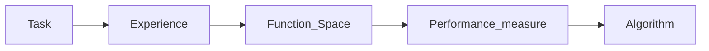

# **Preclass Session 5: Optimization**

## **TEFPA Pipeline**
### **Definition**


- **Task ($\mathcal{T}$)**: is defined of what is the pair of input/output $(x,y)$.

- **Experience (${\mathcal E}$)**: the training dataset $\bf D$ to become experience ${\mathcal E}$ to train the model.
    - In supervised learning: $\bf D = (X,y)$ with $\bf x^t$ is each sample.
    - In unsupervised learning: $\bf D = (X)$ với $\bf x^t$ is each sample.

- **Function Space ($\mathcal{F}$)**: Is a set of parameterized functions (or parametric functions) $f_\theta = ({\boldsymbol \phi}_\alpha, p_w)$ kwhen given the common parameter $\theta$ the change is called the function space $\mathcal{F}$.

- **Performance ($\mathcal{P}$)**: Call $\hat{\theta}$ is the optimized parameters and $\theta^k$ is the current dataset.
    - To deteremine whether $\theta^k$ is optimized or not we need to use Performance Measure $\mathcal{P}$ to evaluate the parametrized function $f_{\theta^k}$ 
    - $\mathcal{P}(\theta): {\theta}^k \xrightarrow{(f_{\theta^k},D)} \text{a score}\in\mathbb{R}$. If $\mathcal{P}$ is a Loss Function $\rightarrow$  $\bf \hat{\theta} = \arg \min \space \mathcal{P}(\theta, X,y)$ with $\bf (X,y)$ are constants from $\bf {\mathcal E}$

- **Algorithm ${\mathcal A}$**: Once there is performance, apply a search algorithm or optimize ${\mathcal A}$ to update from $\theta^k$ to $\theta^{k+1}$ (through iterations) and finally achieve the optimal $\hat{\theta}$. 


### **Example: Dog and Cat Classification**
- **Task ($\mathcal{T}$)**: input $\bf x$ is an image that contains any photo of a dog or cat $\rightarrow$ output $\bf y$ is the prediction of a cat or a dog.

- **Experience (${\mathcal E}$)**: The self-scraping dataset $\bf D$ in the Session 2 Lab (after splitting) $\bf D = \{\{x^t, y^t\}\}_{t=1}^{2984} = (X,y)$

- **Function Space ($\mathcal{F}$)**: is all functions (models) generated through the training process below.

- **Performance ($\mathcal{P}$)**: We evaluate performance of the function $f_{\theta^k}$ when using the parameters set $\theta^k$ with loss function: **Binary Crossentropy (BE)** $\rightarrow$ optimal $\hat{\theta} = \arg \min \space BE(\theta, \bf{X}, y)$

- **Algorithm ${\mathcal A}$**: We use optimizer **Adam** (or SGD) to update the parameters set $\theta$ based on the loss value (performance). For instance, intial loss is **0.4822** with random $\theta^k$ and after 100 epochs (iterations) we achieve the loss of **0.0386** with optimal $\hat{\theta}$


## **Metrics**
Note: $\bf X \in \mathbb{R}^{N \times d}$ $\rightarrow$ $\bf N$ samples and $\bf d$ features
### **Q1: If Logistic Regression is considered, what is the $\theta^k$?**
- $\theta^k$ is the set of $\bf (w, b)$ in which: 
    - $\bf w$ is a weight vector $\bf {w} = (w_1, w_2,..., w_d)$ with $d$ is the dimension of data (or features) of $\bf X$
    - $\bf b$ (bias) if a number added after performing dot product $\bf w^TX$

### **Q2: If Softmax Regression is considered, What is the $\theta^k$?**
- $\theta^k$ is the set of $\bf (W, b)$ in which: 
    - $\bf W$ is a matrix $\in \mathbb{R}^{c \times d}$ with $c$ is the number of classes (labels). Or $\bf W = [w_1,...w_t,...,w_c]^T$ with $\bf w_t$ is a row vector with $d$ dimensions.
    - Bias $\bf b \in \mathbb{R}^c$ is a **vector** with $C$ dimension, added after performing dot product $\bf W^TX$


## **Tensorflow advanced**
### **Initialize weights for layers**
The weights are randomly generated at an early stage and then gradually optimized during training.

Current models mostly use `relu` with the weight-initialization formula associated `He Initialization`
    
```python
model.add(LayerName(...., kernel_initializer="he_normal"))
```

### **Change the learning rate of optimizer**
```python
from tensorflow.keras.optimizers import Adam, AdamW

adam = Adam(learning_rate=0.0003)
model.compile(optimizer=adam, ...)
```

### **Early Stopping**
The EarlyStopping technique allows us to stop training when the loss or metric does not decrease after n_epoch.


```python
from tensorflow.keras.callbacks import EarlyStopping

cb_early_stopping = EarlyStopping(monitor='val_loss', patience=15, restore_best_weights=True)
history = model.fit(..., callbacks=[cb_early_stop])
```